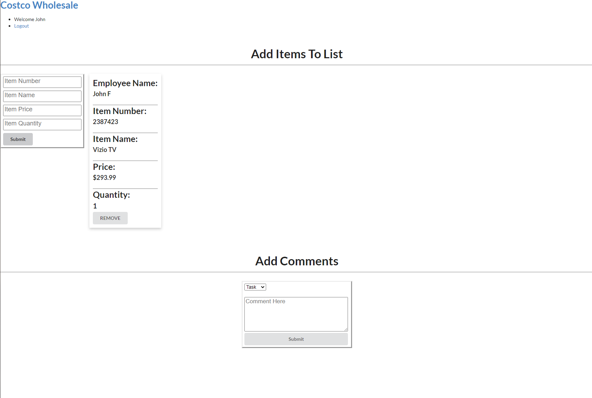
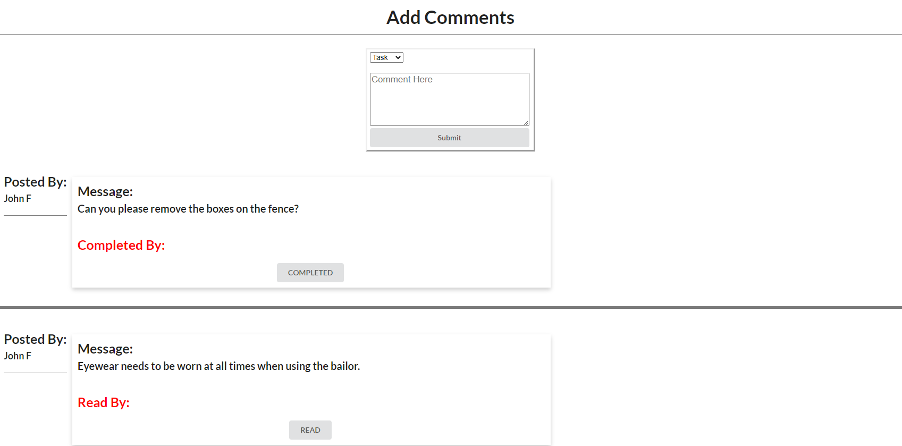

# Retail Comms
 
## Links
* Repository: https://github.com/masonmarinko/retail-comms

## Technologies Used
* React
* Express
* Node.js
* Javascript
* Typescript
* CSS
* HTML
* Axios
* Mongoose
* MongoDB

## My Story

- I finished a boot camp through University of Utah at the end of 2020. I wanted to find a need and try to address it on my own time. At the moment I'm still working my full time job at Costco Wholesale as a Major Sales Assistant and at night I try to put in time to this project to continue to learn and gain experience.

## Back Story

- Retail Comms was created to fill a couple needs at my current job (Major Sales Assistant at Costco Wholesale). The first thing was based on our returns and last items that are in lock up. Non management personnel are the only employees that are allowed in the "Merchandise Pickup Cage" or plainly the lock up cage where high price or possible high theft items are kept. Because of this I wanted to add a section where employees could add and remove items which allows them to quickly see what's in the cage, prices (in case marked down), quantity and description. I also have future ideas such as adding notes as well for displays, last items, etc. The next thing I noticed was how often employees need to text about things needing to be done in group chats. The issue is all employees in group chats are seeing everything, even if it doesn't apply to them. I created the comment section in order to give the employee a change to "check" on tasks and memos when they get to work and are on the clock. I have plans to increase this to separate based on department and a way managers can look over all. I've made 2 things you can specify the comment as. If something is marked as a task an employee can mark it as complete and their name is linked to it. When the manager removes the task it also verifies that the employee completed the task before removing. This will allow employees to get credit for doing tasks, could help with career advancement. The second is a memo, at times information is supposed to be passed to all employees where acknowledgment is required. When a memo is posted the employees can click "read" and their name is linked to it. The manager can then verify that everyone has read it. A future feature is the ability to save memos to a managers board in order to keep for records in case there are any issues with an employee saying they weren't told something, or had questions. I've listed just some of the items I want to add to this app in the future, but in the meantime its a way for me to learn new technologies (Typescript, Axios, Passport are some specific to this project) while continuing to reinforce things I learned in boot camp, mainly the MERN stack.

## Website Look/Layout

- As mentioned before styling is to come, in the meantime i'm working on the architecture of the site. In the future I'm hoping to have a dashboard that would make the app more efficient from the user side.

### Home Screen

- Very simple home page, you can either post items or comments. When posting a comment you will select either a memo or task. Tasks are meant to be things that can be completed while memos are not things that can be completed but more passing information to employees and getting their acknowledgment that they've seen the message.

Home Screen: 

### Item Posted

- In the meantime an item can be added and removed with the following information Item Number, Item Name, Item Price, Item Quantity. The users name will automatically posted if they're logged in. If a user is not logged in and tries to post they will be met with an error. I have multiple updates planned for items and posting. Adding/Removing quantity in case there is more than 1, the ability to open a drop down which someone could further specify things such a last one, display only, or other information the sales floor might like the member/customer to know.

Item Posted: 

Not Logged In Alert: 

### Comment Posted (Task or Memo)

- Also for now this is for anyone to post a task or a memo for other employees to read or complete. A user that is not logged in will not be able to post a comment or select completed or read on a comment if they're not logged in.

Comment Posted (Memo and Task to show different buttons): 

- There are also different views. The person posting the comment will only see remove buttons where the people reading the posts will see read for memos or completed for tasks.

Task vs Memo Person Posting View: 

Task vs Memo Person Reading View: 

### Errors If User Removes Task or Memo Before Someone Has Selected Read or Completed

- For now i'm using alerts to pass along errors or messages. These will be modals once the project is live. The alerts here are prompted by a user removing a task or memo before anyone has read or completed them. For now, the same message on memos is used for removing a memo with or without people having "read" it.

Alert for Removing Memo Before Anyone Selected Read: 

Alert for Removing Memo Before Anyone Selected Completed: 

### Alerts If User Selects Completed After Someone Has Already Completed

- First screenshot is an alert letting the employee know someone has already selected complete. The second is alerting an employee that they have already selected "read" on the memo.

Alert That A User Has Already Completed Task: 

Alert That User Has Already Selected Read: 

### What Page Looks Like With Completed And Read Selected

- This is how the comments look with users attached as either completed or read.

Tasks and Memos Marked as "read" and "completed": 

### User Who Posted Removing Items Alerts

- When a user removes their own memo or task they will be met with different alerts. As mentioned before if the post has no one on it an alert will ask if they are sure they want to remove a comment that no one has completed. However, when removing one with users attached they will be met by 1 of 2 alerts. If a task is removed the alert will state "have you verified (users name) has completed the task" if a memo is removed it asks "have you verified that all users have read the memo". Again, for now, the same message on memos is used for removing a memo with or without people having "read" it.

Alert Removing Memo With Users Attached: 

Alert Removing Task with User Attached: 

## Creators
- Mason Marinko (email: mason.p.marinko@gmail.com)
